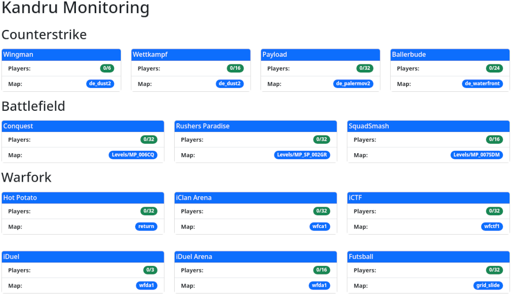

# Zabbix Status Dashboard

A modern single-page application built with Vite that provides a clean, responsive interface for monitoring Zabbix hosts. Features Bootstrap 5 styling for an intuitive user experience. This has been created because I was looking for an simple way to publically display statistics about my infrastructure for everyone. Check out our running dashboard at https://status.kandru.de.



## 🚀 Development

### Zabbix Configuration

This frontend needs a separate zabbix account which is READ ONLY for the given hosts you want to monitor. I recommend to create a new host group (e.g. Dashboard) and add an zabbix account which has READ ONLY permissions to this host group. Disable everything except the API access to prevent changes of the password etc.. Also make sure to ONLY expose hosts which can safely be exposed COMPLETELY. Because even the fronted may only shows a subset of the data - the API can still deliver all the other information of a host.

### Prerequisites
- Node.js and npm installed on your system

### Setup
1. **Configure the application**
    ```bash
    cp config.default.jsx config.jsx
    ```
    Edit `config.jsx` with your Zabbix server details.

2. **Install dependencies**
    ```bash
    npm install -D vite
    ```

3. **Start development server**
    ```bash
    npm run dev
    ```
    Open your browser and navigate to `http://localhost:3000`

## 📦 Building & Deployment

### Build for production
```bash
npm run build
```

### Deploy
Upload the contents of the `dist` folder to your web server's public directory.

---

*Ready to monitor your infrastructure with style! 📊*
